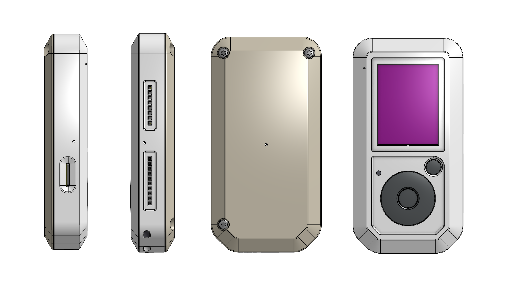

# High Boy 3D Case

3D printable STL files for the High Boy case. 4-part model ready to download and print. Free for the community.

## Files

| File | Description |
|------|-------------|
| `00-HIGH_BOY-MD_ASM.stl` | Full assembly model |
| `HOUSING_ASM.stl` | Housing / enclosure |
| `LCD-BRACKET_ASM.stl` | LCD bracket mount |
| `HIGH_BOY-KEY_ASM.stl` | Key / button assembly |

## How to Print

1. Download the STL files from the `high-boy/` folder
2. Import into your preferred slicer (Cura, PrusaSlicer, etc.)
3. Print and assemble all parts

## Community and Support

Feel free to open an issue if you have questions or suggestions.

## License

GPL-3.0 — Free to use, modify, and share.
